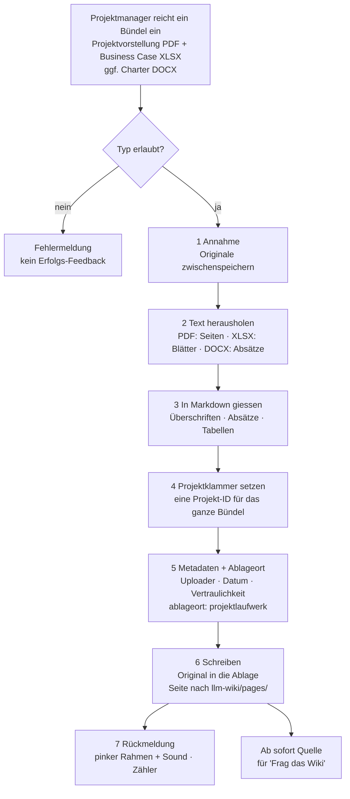

# Funktionsweise: Wie Dateien verarbeitet werden

Teil der Funktionsbeschreibung des Systems (Arbeitspaket 3). Dieses Kapitel beschreibt genau
einen Weg: **was das LLM-Wiki mit einer hochgeladenen Datei macht, damit sie für Abfragen
verfügbar wird.** Der Frageweg und die vier Experten-Agenten folgen in eigenen Kapiteln.

Stand: 2026-09-05 · Basis: `PLAN.md`, `Arbeitspakete.md`, Code unter `llm-wiki/`

---

## 1. In einem Satz

Eine hochgeladene Datei wird in Text umgewandelt, in Absätze zerlegt, mit Metadaten versehen,
an einem nachvollziehbaren Ablageort gespeichert und als Markdown-Seite in `llm-wiki/pages/`
abgelegt — ab dann durchsucht sie jede Frage automatisch mit.

---

## 2. Zwei Wege ins Wissen

Es gibt zwei Arten, wie Dokumente ins System kommen. Das ist der häufigste Punkt der
Verwirrung, deshalb steht er ganz vorn.

| | **A: Demo-Korpus** | **B: Upload** |
|---|---|---|
| Was | 216 vorbereitete Dokumente der fiktiven Lahnberg Thermotechnik GmbH | Dateien, die ein Nutzer im Betrieb hochlädt |
| Wo | `corpus/`, 9 Ablageorte, Zeitraum 2011–2025 | `llm-wiki/pages/` + Ablage der Originaldatei |
| Format | Markdown mit YAML-Frontmatter (13 Metadatenfelder) | PDF, DOCX, XLSX, MD, TXT → wird zu Markdown |
| Status | **liegt im Repo** | **Zielbild, Arbeitspaket 2** |
| Vom Wiki durchsucht | **nein** (noch nicht angebunden) | ja |

Der Korpus ist heute die realistische Wissenslandschaft *auf der Platte*, aber noch nicht die
Wissensbasis *der laufenden Anwendung*. Der Upload-Weg produziert die Struktur, die den Korpus
später einlesbar macht — beide treffen sich im selben Metadaten-Schema (Abschnitt 5).

---

## 3. Was heute wirklich passiert (IST)

Im laufenden LLM-Wiki gibt es **noch keinen Datei-Upload**. Inhalte entstehen ausschließlich
über zwei Formulare:

- `GET/POST /new` — neue Seite anlegen (`llm-wiki/app/main.py:115`)
- `GET/POST /wiki/{slug}/edit` — bestehende Seite ändern (`llm-wiki/app/main.py:91`)

Ein Speichervorgang läuft so (`llm-wiki/app/wiki.py`):

1. **Slug bilden** — `slugify(titel)`: kleinschreiben, Leerzeichen zu `-`, alles außer
   `a–z 0–9 -` wird **entfernt**. Umlaute und Sonderzeichen fallen weg; aus „heute ist ein
   schöner Tag" wird `heute-ist-ein-schner-tag.md`. Nachzusehen in `llm-wiki/pages/`.
2. **Datei schreiben** — `llm-wiki/pages/<slug>.md`, Inhalt `# <Titel>` + Leerzeile + Text.
   Der Titel lebt in der ersten Zeile, nicht in Metadaten.
3. **Fertig.** Kein Frontmatter, keine Datenbank, kein Index, kein Uploader, kein Zeitstempel,
   kein Ablageort. Das Dateisystem *ist* die Wissensbasis.

Beim Umbenennen wird die alte Datei gelöscht und unter neuem Slug neu geschrieben
(`llm-wiki/app/main.py:100`) — ein gleicher Titel überschreibt also stillschweigend eine
bestehende Seite. Eine Dublettenprüfung gibt es nicht.

Gelesen wird bei **jeder** Anfrage frisch von der Platte (`list_pages()` durchläuft
`pages/*.md`). Deshalb ist eine neue Seite sofort auffindbar — ohne Neustart, ohne
Reindexierung. Der Preis ist, dass die Suche linear über alle Dokumente läuft.

---

## 4. Was passiert, wenn Projektdaten hochgeladen werden (ZIEL)

Das ist der Kern dieses Dokuments: Ein Projektmanager lädt die Unterlagen zu einem Projekt
hoch. Was macht das Wiki damit, damit anschließend jemand danach fragen kann?

### 4.1 Was „Projektdaten" konkret sind

Ein Projekt wird nicht als eine Datei eingereicht, sondern als **Bündel** — typischerweise
eine erzählende Datei und eine rechnende Datei:

| Rolle im Bündel | Format | Enthält | Beitrag zur Bewertung |
|---|---|---|---|
| **Projektvorstellung** | PDF | Worum geht es, warum jetzt, was ist der Nutzen | Beschreibung, Ziel, Nutzenargumentation |
| **Business Case** | XLSX | Kosten, Nutzen, Wirtschaftlichkeitsrechnung | Die Zahlen für den CFO-Agenten |
| **Project Charter** | DOCX | Formaler Steckbrief: ID, Land, Deliverables, Eckzahlen | Struktur- und Stammdaten |

Die Projektvorstellung wird als **PDF** eingereicht — eine Foliendatei exportiert der
Einreicher vorher. Das hält die Zahl der Parser klein und ist verlustfrei genug: der
Textinhalt der Folien bleibt erhalten (siehe Abschnitt 6).

Nicht jedes Bündel enthält alle drei Teile. Projektvorstellung plus Business Case ist der
übliche Fall — das Charter kommt oft erst später dazu. Das Wiki darf deshalb kein bestimmtes
Set erzwingen, sondern verarbeitet, was kommt, und hält fest, was fehlt. Genau darauf setzt
später der Completeness Check aus `PLAN.md` §2 auf.

**Vollständig durchgespielt** an dem Bündel, das in `test project data/` liegt (M:INVOICE –
CONI, Company 1):

| Datei | Typ | Enthält |
|---|---|---|
| `__Project_Charter_M-Invoice_Company1.docx` | DOCX, ~38 KB | Der Steckbrief: Projekt-ID, Ziel, betroffene Länder, Deliverables, Eckzahlen. 25 Textabsätze. |
| `__Business_Case_M-Invoice_CONI_Company1.xlsx` | XLSX, ~78 KB | Das Zahlenwerk: 11 Arbeitsblätter, Kosten, Nutzen, Wirtschaftlichkeitsrechnung. |

Alle Dateien eines Bündels beschreiben **dasselbe Projekt** aus verschiedenen Blickwinkeln. Das
Wiki muss sie deshalb über einen gemeinsamen Schlüssel verbinden — hier die Projekt-ID
`PRJ-0412.1` aus dem Charter. Ohne diese Klammer stehen Vorstellung und Zahlen unverbunden
nebeneinander, und eine Frage wie „Was kostet CONI und warum machen wir das?" findet nur eine
Hälfte.

> **Die Zielform existiert bereits.** `project_proposals/m-invoice-coni-company1.md` ist genau
> das, was der Upload automatisch erzeugen soll: eine Markdown-Seite mit Frontmatter, die unter
> `source_documents` auf beide Originaldateien verweist, und mit Überschriften nach der
> Feldliste aus `PLAN.md` §2. Diese vier Dateien wurden von Hand erstellt — sie sind die
> Referenz, an der sich die automatische Verarbeitung messen lässt.

### 4.2 Der Weg im Überblick



### 4.3 Die sieben Schritte, konkret

**1 — Annahme.** Datei entgegennehmen, Typ und Größe prüfen. Ein nicht unterstützter Typ führt
zu einer klaren Fehlermeldung und **keinem** Erfolgs-Feedback (Paket 5 hängt sich nur an den
Erfolgsfall).

**2 — Text herausholen.** Je Dateityp ein eigener Parser, Details in Abschnitt 6. Beim Charter
kommen 25 Absätze heraus, die abwechselnd Feldname und Wert sind:

```
'PRJ-0412.1*'
'M:INVOICE - CONI (CONSOLIDATED INVOICES)'
'OperatingPartner'      'Company 1'
'Lead - AffectedCountries'   'CORP - BE; CORP; DE; ES; FR; HR; HU; IT; NL; PL; PT'
'TotalOne-Off'          '450 T€*'
'Avg.Recurrent'         '90 T€*'
```

**3 — In Markdown gießen.** Hier entscheidet sich, ob das Dokument später auffindbar ist. Zwei
Regeln, die aus der Funktionsweise der Suche folgen (nachgerechnet in Abschnitt 4.5):

- **Feldname und Wert gehören in denselben Absatz.** `**Total One-Off:** 450 T€` — nicht der
  Wert allein in einem eigenen Absatz. Ein alleinstehendes „450 T€" ist für die Suche ein
  Waisenabsatz ohne jeden Anknüpfungspunkt.
- **Zusammengeschriebene Feldnamen auftrennen.** Aus `TotalOne-Off` wird `Total One-Off`, aus
  `Avg.Recurrent` wird `Avg. Recurrent`. Der Grund steht in 4.5: die Suche zerlegt Text in
  Wörter, und `TotalOne` ist ein Wort, das in keiner Frage vorkommt.

**4 — Projektklammer setzen.** Alle Seiten, die aus einem Bündel entstehen, bekommen dieselbe
Projekt-ID ins Frontmatter (`projekt: PRJ-0412.1`). Damit lassen sich Charter und Business Case
später gemeinsam auswerten, und Marcs Dublettenprüfung (Paket 4) hat einen Schlüssel, gegen den
sie vergleichen kann.

**5 — Metadaten und Ablageort.** Frontmatter nach dem Schema aus Abschnitt 5. Projektdaten
gehören nach `ablageort: projektlaufwerk` — im Korpus liegen dort bereits 36 Dokumente. Uploader
und Uploadzeitpunkt kommen aus der Sitzung; `datum` ist dagegen das **fachliche** Dokumentdatum,
nicht der Uploadzeitpunkt.

**6 — Schreiben.** Zwei Dinge landen auf der Platte: die **Originaldatei** unverändert in der
Ablage (Paket 7) und die **Markdown-Seite** in `llm-wiki/pages/`. Achtung beim Slug — `slugify`
entfernt Sonderzeichen ersatzlos:

```
"M:INVOICE – CONI (Consolidated Invoices)"  →  minvoice--coni-consolidated-invoices.md
```

Der Doppelbindestrich stammt vom entfernten Gedankenstrich. Wer lesbare Dateinamen will, muss
`slugify` erweitern (Umlaute transliterieren, Mehrfach-Bindestriche zusammenfassen) — heute
tut es das nicht.

**7 — Rückmeldung.** Pinker Rahmen und kurzer Sound (Paket 5), Zähler auf `/stats` erhöht sich
(Paket 6). Weil bei jeder Anfrage frisch von der Platte gelesen wird, steigt der Zähler ohne
Neustart, und die nächste Frage durchsucht das neue Dokument bereits mit.

### 4.4 Was danach auf der Platte liegt

```
llm-wiki/pages/
  minvoice--coni-consolidated-invoices.md      ← Charter als Wiki-Seite
  minvoice--coni-business-case.md              ← Business Case als Wiki-Seite
corpus/projektlaufwerk/2026/
  __Project_Charter_M-Invoice_Company1.docx    ← Original, unverändert
  __Business_Case_M-Invoice_CONI_Company1.xlsx ← Original, unverändert
```

Die erzeugte Seite sieht so aus:

```markdown
---
doc_id: PRJ-0412.1-CHARTER
titel: "M:INVOICE – CONI (Consolidated Invoices)"
dokumenttyp: Projektauftrag
datum: 2026-01-15
verfasser: Invoice Product Lead
rolle: Project Manager
organisationseinheit: Finance & Customer Services
empfaenger: []
projekt: PRJ-0412.1
geschaeftsbereich: "Company 1 – Digital Customer Experience"
vertraulichkeit: intern
informationsdomaene: [projekt]
ablageort: projektlaufwerk
quelldatei: "test project data/__Project_Charter_M-Invoice_Company1.docx"
---

# M:INVOICE – CONI (Consolidated Invoices)

**Operating Partner:** Company 1

**Betroffene Länder:** CORP – BE; CORP; DE; ES; FR; HR; HU; IT; NL; PL; PT

**Beschreibung:** Viele Kunden, insbesondere Großkunden, erwarten eine regelmäßige …

**Total One-Off:** 450 T€

**Avg. Recurrent:** 90 T€
```

`dokumenttyp: Projektauftrag` ist bewusst gewählt: im Korpus gibt es diesen Typ bereits
elfmal, das neue Dokument fügt sich also in eine vorhandene Kategorie ein statt eine neue
aufzumachen.

### 4.5 Und so taucht es in einer Abfrage auf

Jemand fragt unter „Frag das Wiki":

> **Wie hoch sind die One-Off-Kosten für CONI?**

Das Wiki zerlegt die Frage in Wörter und vergleicht sie absatzweise mit allen Seiten. Diese
Werte sind **nachgerechnet**, nicht geschätzt:

| Absatz auf der Seite | erkannte Wörter | Überschneidung | Score |
|---|---|---|---|
| `TotalOne-Off 450 T€` (roh übernommen) | `450, off, t, totalone` | `off` | **0,11** |
| `**Total One-Off:** 450 T€` (normalisiert) | `450, off, one, t, total` | `off, one` | **0,22** |
| `**Iteration Value:** 180 T€` | `180, iteration, t, value` | – | **0,00** |

Die Normalisierung aus Schritt 3 **verdoppelt** den Score desselben Inhalts. Die besten fünf
Absätze gehen anschließend als Kontext an Claude, das ausschließlich daraus antwortet und die
verwendeten Seitentitel nennt (`llm-wiki/app/llm.py`).

Daran hängt die wichtigste Einsicht für die Dateiverarbeitung: **Die Qualität der Extraktion
entscheidet über die Auffindbarkeit, nicht die Qualität des Prompts.** Was beim Einlesen zu
einer Textwand verklebt oder als Wortsalat ankommt, ist danach nicht mehr zu retten.

---

## 5. Das Metadaten-Schema

Der Demo-Korpus gibt das Schema bereits vor — **alle 216 Dokumente** tragen dieselben
13 Felder im YAML-Frontmatter. Der Upload sollte dieselben Felder füllen, sonst zerfällt die
Wissensbasis in zwei Welten.

```yaml
---
doc_id: LTT-20200929-IT-A20          # eindeutige Dokumentnummer
titel: Softwareportfolio der LTT-Gruppe 2020
dokumenttyp: Softwareportfolio       # Policy, SOP, Meeting Minutes, Projektauftrag …
datum: 2020-09-29                    # fachliches Dokumentdatum, nicht der Uploadzeitpunkt
verfasser: Karin Löbner
rolle: Leiterin IT
organisationseinheit: IT
empfaenger: []
projekt: "-"
geschaeftsbereich: "-"
vertraulichkeit: intern              # intern | C-Level | Betriebsrat-intern
informationsdomaene: [unternehmensweit]
ablageort: it_doku                   # einer von 9 Ablageorten
---
```

Drei Felder tragen die Logik des Gesamtsystems:

- **`vertraulichkeit`** — im Korpus 180× `intern`, 23× `C-Level`, 13× `Betriebsrat-intern`.
  Daran hängt Arbeitspaket 1: Treffer, die der Fragende nicht sehen darf, dürfen dem LLM gar
  nicht erst vorgelegt werden. Das ist die technische Umsetzung der Informationsgrenzen aus
  `PLAN.md` §4.
- **`datum`** — der Korpus spannt 2011 bis 2025 und enthält bewusst veraltete und
  widersprüchliche Aussagen (`PLAN.md` §3). Ohne Datum kann kein Agent Aktualität beurteilen.
- **`ablageort`** — bestimmt die Ordnerstruktur (Paket 7), leitet Rechte ab (Paket 1) und ist
  die Gruppierung in der Statistik (Paket 6).

Die 9 Ablageorte im Korpus mit ihrer Dokumentzahl:

| Ablageort | Dok. | Ablageort | Dok. |
|---|---:|---|---:|
| `sharepoint_gf` | 47 | `qm_lenkung` | 24 |
| `projektlaufwerk` | 36 | `einkauf_scm` | 21 |
| `it_doku` | 29 | `sharepoint_hr` | 18 |
| `br_ablage` | 15 | `sharepoint_finance` | 14 |
| `mailarchiv` | 12 | | |

---

## 6. Extraktion je Dateityp

### PDF — die Projektvorstellung

Der wichtigste Fall, weil die Projektvorstellung so eingereicht wird. Ein PDF, das aus
Präsentationsfolien exportiert wurde, verhält sich anders als ein Fließtextdokument:

- **Eine Seite wird ein Abschnitt**, die größte Schrift der Seite wird die Überschrift. Die
  Seitengrenze ist die natürliche Absatzgrenze — anders als bei Fließtext, wo Seitenumbrüche
  mitten im Satz liegen und beim Zusammensetzen wieder verschwinden müssen.
- **Stichpunkte sind kurz.** „ROI 3,16" oder „Go-Live Q3" tragen kaum Wörter, an denen die
  Wortsuche greifen kann. Deshalb muss die Folienüberschrift mit in den Abschnitt — dann zählen
  ihre Wörter zum Treffer. Genau das tut die Suche für Seitentitel bereits von sich aus
  (`llm-wiki/app/wiki.py:90`); auf Folienebene muss die Extraktion es nachbauen.
- **Diagramme und Screenshots sind für das Wiki unsichtbar.** Ein Wasserfalldiagramm zur
  Kostenverteilung ist ein Bild ohne Text. Wo die Aussage nur im Bild steckt, entsteht eine
  Informationslücke — die gehört benannt, nicht überspielt (`PLAN.md` §7, Phase 5). Der
  Business Case liefert die Zahlen ohnehin belastbarer als eine Folie.
- **Seitenzahlen gehören ins Ergebnis.** „Seite 7" ist die Belegstelle, die ein Mensch
  nachschlagen kann — das Gegenstück zur Dokumentnummer bei den Korpus-Dokumenten.

Fußzeilen, Logos und Agenda-Seiten wiederholen sich auf jeder Seite und gehören nicht in die
Wissensbasis; sonst trägt jeder Absatz denselben Firmennamen und verwässert die Wortsuche.

**Grenzfall:** Gescannte oder als Bild exportierte PDFs haben keinen Textlayer. OCR liegt
außerhalb des Hackathon-Umfangs. Solche Dateien sollten klar abgewiesen werden, statt eine
leere Seite in der Wissensbasis zu hinterlassen — der Upload muss also prüfen, ob überhaupt
Text herauskam, und nicht nur, ob die Datei lesbar war.

---

### XLSX — der Business Case

Die Testdatei hat **11 Arbeitsblätter**, und sie sind sehr unterschiedlich wertvoll:

| Blatt | Zellen | In die Wissensbasis? |
|---|---:|---|
| `Summary` | 1196 | **ja** — die Kernaussage |
| `Costs & Benefits` | 3251 | **ja, aber verdichtet** — 3251 Zellen roh ergeben eine Zahlenwand |
| `Project Cost Description` | 11 | ja |
| `Benefit Calculation` | 23 | ja |
| `List of Demands`, `Demand N°1/2 Benefit` | 35 / 56 / 67 | ja |
| `Project Description` | **0** | leer — der Fließtext steht im Charter, nicht hier |
| `Selection lists` | 158 | **nein** — Dropdown-Vorrat: Länderlisten, Steuersätze, WACC |
| `Definition_Service Categories` | 48 | nein — Nachschlagetabelle |
| `Upload` | 463 | nein — Transportblatt des Quellsystems |

Zwei Konsequenzen:

- **Nicht jedes Blatt gehört ins Wiki.** Allein `Selection lists` würde rund 240
  Nachschlagewerte (Ländernamen, Steuersätze) in den Index kippen und die Wortsuche verwässern
  — „Portugal" träfe dann jeden Business Case, egal ob das Projekt Portugal betrifft.
- **Formeln müssen nicht gerechnet werden.** Alle Formelzellen der relevanten Blätter tragen
  ein zwischengespeichertes Ergebnis (`Summary` 210 von 210, `Costs & Benefits` 459 von 459).
  Ein Reader im Nur-Werte-Modus liefert also die Zahlen, ohne dass Excel installiert sein muss.

### DOCX — der Project Charter

Absätze und Tabellen auslesen. Der Charter ist im Kern eine Tabelle aus Feldname und Wert; die
Paarung muss die Extraktion überleben (Regel aus 4.3). Deckblätter, Kopf- und Fußzeilen sind
Rauschen und gehören nicht in die Seite. Die Dateieigenschaften helfen übrigens nicht weiter:
in den Testdateien steht als Autor `python-docx` und als Erstelldatum 2013 — `verfasser` und
`datum` müssen aus dem Inhalt oder vom Uploader kommen, nicht aus den Metadaten der Datei.

### MD / TXT

Direkt übernehmen. Vorhandenes Frontmatter erkennen und nicht als Fließtext behandeln — sonst
landen `doc_id` und `vertraulichkeit` als durchsuchbarer Inhalt in der Wissensbasis.

## 7. Abgleich mit PLAN.md — umgesetzt vs. Zielbild

| Aus `PLAN.md` | Stand |
|---|---|
| §3 Wissensbasis als RAG-System | **teilweise** — Retrieval existiert, aber als Wortabgleich statt Embeddings |
| §3 Realistischer Korpus mit Widersprüchen und Zeitbezug | **vorhanden** als `corpus/` (216 Dok., 2011–2025), **noch nicht** an die Anwendung angebunden |
| §3 Rückführung neuen Wissens (*Retrieve → … → Store → Reuse*) | **offen** — der Upload-Weg ist die Vorstufe dazu |
| §4 Zugriffsrechte, Informationsklassifikation, Herkunft | **im Schema angelegt** (`vertraulichkeit`, `verfasser`, `informationsdomaene`), **nicht durchgesetzt** — Paket 1 |
| §5 Orchestrator-Agent | **offen** |
| §6 Vier Experten-Agenten | **eine Rolle** liegt als Dokument vor: `bewertungen/cfo-bewertung-projektportfolio.md`; keine Agenten im Code |
| §8 Output-Schema | **uneinheitlich, siehe unten** |
| Externe Recherche / Web-Skill | **offen** |

**Ein offener Widerspruch, der geklärt gehört:** `PLAN.md` §8 verlangt pro Agent *drei* Scores
(`value_score`, `risk_score`, `strategy_score`) auf einer Skala 0–100 im Format JSONL.
`Bewertungslogik_Experten-Agent_MVP.md` verlangt *einen* Score auf einer Skala 0–10 und verbietet
ausdrücklich jede Bewertung bei fehlenden Informationen. Die bereits erstellte CFO-Bewertung folgt
der zweiten Variante. Solange das nicht entschieden ist, kann der Orchestrator die vier
Stellungnahmen nicht zusammenführen — das trifft Paket 4 und die späteren Agenten-Pakete.

**Zweiter Punkt:** Der Korpus beschreibt die Lahnberg Thermotechnik GmbH, die Projektvorschläge
unter `project_proposals/` betreffen ein anderes fiktives Unternehmen („Company 1" / „Company 2").
Die CFO-Bewertung hat den Korpus deshalb bewusst ausgeklammert. Für die Demo heißt das: Vorschlag
und Wissensbasis passen inhaltlich (noch) nicht zusammen.

---

## 8. Wer liefert was

| Frage | Paket | Verantwortlich |
|---|---|---|
| Welche Metadaten, wer darf was sehen? | 1 | Anselm |
| Upload-Formular und Textextraktion | 2 | Ekkehardt |
| Dieses Dokument | 3 | Florian |
| Dublettenerkennung gegen bestehende Projekte | 4 | Marc |
| Rückmeldung nach erfolgreichem Upload | 5 | Oxana |
| Zähler über die Wissensbasis | 6 | Antje |
| Ablageorte und Ordnerstruktur | 7 | Frank |

Reihenfolge: Paket 1 legt das Schema fest, 2 und 7 bauen den eigentlichen Weg, 5 und 6 hängen
sich an das Erfolgsereignis. Bis der Upload steht, arbeiten 5 und 6 gegen einen Testbutton.

Abnahmekriterium von Paket 2 ist genau der in Abschnitt 4 beschriebene Durchlauf: ein Project
Charter aus `test project data/` wird hochgeladen und taucht danach als Quelle unter „Frag das
Wiki" auf.
