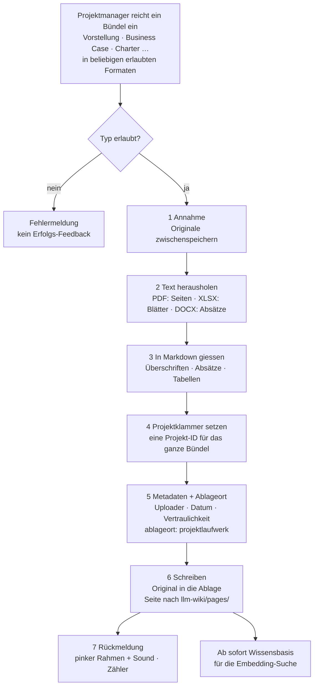

# Funktionsweise: Wie Dateien verarbeitet werden

Teil der Funktionsbeschreibung des Systems (Arbeitspaket 3). Dieses Kapitel beschreibt genau
einen Weg: **was das LLM-Wiki mit einer hochgeladenen Datei macht, damit sie für Abfragen
verfügbar wird.** Der Frageweg und die vier Experten-Agenten folgen in eigenen Kapiteln.

Stand: 2026-09-05 · Basis: `PLAN.md`, `Arbeitspakete.md`, Code unter `llm-wiki/`

---

## 1. In einem Satz

Eine hochgeladene Datei wird in Text umgewandelt, in Absätze zerlegt, mit Metadaten versehen,
an einem nachvollziehbaren Ablageort gespeichert und als Markdown-Seite in `llm-wiki/pages/`
abgelegt — ab dann durchsucht sie jede Frage automatisch mit.

---

## 2. Zwei Wege ins Wissen

Es gibt zwei Arten, wie Dokumente ins System kommen. Das ist der häufigste Punkt der
Verwirrung, deshalb steht er ganz vorn.

| | **A: Demo-Korpus** | **B: Upload** |
|---|---|---|
| Was | 218 vorbereitete Dokumente der fiktiven Lahnberg Thermotechnik GmbH | Dateien, die ein Nutzer im Betrieb hochlädt |
| Wo | `corpus/`, 9 Ablageorte, Zeitraum 2011–2025 | `llm-wiki/pages/` + Ablage der Originaldatei |
| Format | Markdown mit YAML-Frontmatter (13 Metadatenfelder) | PDF, DOCX, XLSX, MD, TXT → wird zu Markdown |
| Status | **liegt im Repo** | **Zielbild, Arbeitspaket 2** |
| Vom Wiki durchsucht | **nein** (noch nicht angebunden) | ja |

Der Korpus ist heute die realistische Wissenslandschaft *auf der Platte*, aber noch nicht die
Wissensbasis *der laufenden Anwendung*. Der Upload-Weg produziert die Struktur, die den Korpus
später einlesbar macht — beide treffen sich im selben Metadaten-Schema (Abschnitt 5).

---

## 3. Was heute wirklich passiert (IST)

Im laufenden LLM-Wiki gibt es **noch keinen Datei-Upload**. Inhalte entstehen ausschließlich
über zwei Formulare:

- `GET/POST /new` — neue Seite anlegen (`llm-wiki/app/main.py:115`)
- `GET/POST /wiki/{slug}/edit` — bestehende Seite ändern (`llm-wiki/app/main.py:91`)

Ein Speichervorgang läuft so (`llm-wiki/app/wiki.py`):

1. **Slug bilden** — `slugify(titel)`: kleinschreiben, Leerzeichen zu `-`, alles außer
   `a–z 0–9 -` wird **entfernt**. Umlaute und Sonderzeichen fallen weg; aus „heute ist ein
   schöner Tag" wird `heute-ist-ein-schner-tag.md`. Nachzusehen in `llm-wiki/pages/`.
2. **Datei schreiben** — `llm-wiki/pages/<slug>.md`, Inhalt `# <Titel>` + Leerzeile + Text.
   Der Titel lebt in der ersten Zeile, nicht in Metadaten.
3. **Fertig.** Kein Frontmatter, keine Datenbank, kein Index, kein Uploader, kein Zeitstempel,
   kein Ablageort. Das Dateisystem *ist* die Wissensbasis.

Beim Umbenennen wird die alte Datei gelöscht und unter neuem Slug neu geschrieben
(`llm-wiki/app/main.py:100`) — ein gleicher Titel überschreibt also stillschweigend eine
bestehende Seite. Eine Dublettenprüfung gibt es nicht.

Gelesen wird bei **jeder** Anfrage frisch von der Platte (`list_pages()` durchläuft
`pages/*.md`). Deshalb ist eine neue Seite sofort auffindbar — ohne Neustart, ohne
Reindexierung. Der Preis ist, dass die Suche linear über alle Dokumente läuft.

---

## 4. Was passiert, wenn Projektdaten hochgeladen werden (ZIEL)

Das ist der Kern dieses Dokuments: Ein Projektmanager lädt die Unterlagen zu einem Projekt
hoch. Was macht das Wiki damit, damit anschließend jemand danach fragen kann?

### 4.1 Was „Projektdaten" konkret sind

Ein Projekt wird nicht als eine Datei eingereicht, sondern als **Bündel** aus mehreren
Dokumenten. Übliche Rollen in so einem Bündel sind:

| Rolle im Bündel | Enthält typischerweise | Beitrag zur Bewertung |
|---|---|---|
| **Projektvorstellung** | Worum geht es, warum jetzt, was ist der Nutzen | Beschreibung, Ziel, Nutzenargumentation |
| **Business Case** | Kosten, Nutzen, Wirtschaftlichkeitsrechnung | Die Zahlen für den CFO-Agenten |
| **Project Charter** | Formaler Steckbrief: ID, Land, Deliverables, Eckzahlen | Struktur- und Stammdaten |

> **Wichtig: Das Dateiformat sagt nichts über den Inhalt.** Ein Business Case kann als PDF
> kommen, eine Projektvorstellung als DOCX, ein Charter als XLSX-Blatt. Die Rolle ergibt sich
> aus dem Inhalt oder aus der Angabe des Einreichers — **nie aus der Dateiendung.** Das System
> darf daraus keine Regel machen, sonst liest es ein PDF voller Zahlen als Fließtext oder
> verwirft ein Charter, weil es im „falschen" Format kam.
>
> Die Dateiendung entscheidet nur **eines**: welcher Parser die Datei aufmacht (Abschnitt 6).
> Was drinsteht, stellt sich erst danach heraus.

Auch die Zusammensetzung des Bündels ist offen: Nicht jedes Projekt bringt alle drei Rollen
mit, manche bringen weitere (Angebote, Architekturskizzen, Betriebsratsstellungnahmen). Das
Wiki darf deshalb kein bestimmtes Set erzwingen, sondern verarbeitet, was kommt, und hält fest,
was fehlt. Genau darauf setzt später der Completeness Check aus `PLAN.md` §2 auf.

**Vollständig durchgespielt** an dem Bündel, das in `test project data/` liegt (M:INVOICE –
CONI, Company 1):

| Datei | Typ | Enthält |
|---|---|---|
| `__Project_Charter_M-Invoice_Company1.docx` | DOCX, ~38 KB | Der Steckbrief: Projekt-ID, Ziel, betroffene Länder, Deliverables, Eckzahlen. 25 Textabsätze. |
| `__Business_Case_M-Invoice_CONI_Company1.xlsx` | XLSX, ~78 KB | Das Zahlenwerk: 11 Arbeitsblätter, Kosten, Nutzen, Wirtschaftlichkeitsrechnung. |

Alle Dateien eines Bündels beschreiben **dasselbe Projekt** aus verschiedenen Blickwinkeln. Das
Wiki muss sie deshalb über einen gemeinsamen Schlüssel verbinden — hier die Projekt-ID
`PRJ-0412.1` aus dem Charter. Ohne diese Klammer stehen Vorstellung und Zahlen unverbunden
nebeneinander, und eine Frage wie „Was kostet CONI und warum machen wir das?" findet nur eine
Hälfte.

> **Die Zielform existiert bereits — fast.** `project_proposals/m-invoice-coni-company1.md` ist
> im Aufbau genau das, was der Upload automatisch erzeugen soll: eine Markdown-Seite mit
> Frontmatter, die unter `source_documents` auf beide Originaldateien verweist, und mit
> Überschriften nach der Feldliste aus `PLAN.md` §2. Diese vier Dateien wurden von Hand
> erstellt — sie sind die Referenz, an der sich die automatische Verarbeitung messen lässt.
>
> Ihr **Frontmatter** ist allerdings ein anderes als das des Korpus (siehe 5.1) — das ist vor
> dem Bau von Paket 2 zu klären.

### 4.2 Der Weg im Überblick



### 4.3 Die sieben Schritte, konkret

**1 — Annahme.** Datei entgegennehmen, Typ und Größe prüfen. Ein nicht unterstützter Typ führt
zu einer klaren Fehlermeldung und **keinem** Erfolgs-Feedback (Paket 5 hängt sich nur an den
Erfolgsfall).

**2 — Text herausholen.** Je Dateityp ein eigener Parser, Details in Abschnitt 6. Beim Charter
kommen 25 Absätze heraus, die abwechselnd Feldname und Wert sind:

```
'PRJ-0412.1*'
'M:INVOICE - CONI (CONSOLIDATED INVOICES)'
'OperatingPartner'      'Company 1'
'Lead - AffectedCountries'   'CORP - BE; CORP; DE; ES; FR; HR; HU; IT; NL; PL; PT'
'TotalOne-Off'          '450 T€*'
'Avg.Recurrent'         '90 T€*'
```

**3 — In Markdown gießen.** Hier entscheidet sich, ob das Dokument später auffindbar ist. Zwei
Regeln, die aus der Funktionsweise der Suche folgen (nachgerechnet in Abschnitt 4.5):

- **Feldname und Wert gehören in denselben Absatz.** `**Total One-Off:** 450 T€` — nicht der
  Wert allein in einem eigenen Absatz. Ein alleinstehendes „450 T€" ist für die Suche ein
  Waisenabsatz ohne jeden Anknüpfungspunkt.
- **Zusammengeschriebene Feldnamen auftrennen.** Aus `TotalOne-Off` wird `Total One-Off`, aus
  `Avg.Recurrent` wird `Avg. Recurrent`. Der Grund steht in 4.5: die Suche zerlegt Text in
  Wörter, und `TotalOne` ist ein Wort, das in keiner Frage vorkommt.

**4 — Projektklammer setzen.** Alle Seiten, die aus einem Bündel entstehen, bekommen dieselbe
Projekt-ID ins Frontmatter (`projekt: PRJ-0412.1`). Damit lassen sich Charter und Business Case
später gemeinsam auswerten, und Marcs Dublettenprüfung (Paket 4) hat einen Schlüssel, gegen den
sie vergleichen kann.

**5 — Metadaten und Ablageort.** Frontmatter nach dem Schema aus Abschnitt 5. Projektdaten
gehören nach `ablageort: projektlaufwerk` — im Korpus liegen dort bereits 36 Dokumente. Uploader
und Uploadzeitpunkt kommen aus der Sitzung; `datum` ist dagegen das **fachliche** Dokumentdatum,
nicht der Uploadzeitpunkt.

**6 — Schreiben.** Zwei Dinge landen auf der Platte: die **Originaldatei** unverändert in der
Ablage (Paket 7) und die **Markdown-Seite** in `llm-wiki/pages/`. Achtung beim Slug — `slugify`
entfernt Sonderzeichen ersatzlos:

```
"M:INVOICE – CONI (Consolidated Invoices)"  →  minvoice--coni-consolidated-invoices.md
```

Der Doppelbindestrich stammt vom entfernten Gedankenstrich. Wer lesbare Dateinamen will, muss
`slugify` erweitern (Umlaute transliterieren, Mehrfach-Bindestriche zusammenfassen) — heute
tut es das nicht.

**7 — Rückmeldung.** Pinker Rahmen und kurzer Sound (Paket 5), Zähler auf `/stats` erhöht sich
(Paket 6). Weil bei jeder Anfrage frisch von der Platte gelesen wird, steigt der Zähler ohne
Neustart, und die nächste Frage durchsucht das neue Dokument bereits mit.

### 4.4 Was danach auf der Platte liegt

```
llm-wiki/pages/
  minvoice--coni-consolidated-invoices.md      ← Charter als Wiki-Seite
  minvoice--coni-business-case.md              ← Business Case als Wiki-Seite
corpus/projektlaufwerk/2026/
  __Project_Charter_M-Invoice_Company1.docx    ← Original, unverändert
  __Business_Case_M-Invoice_CONI_Company1.xlsx ← Original, unverändert
```

Die erzeugte Seite sieht so aus:

```markdown
---
doc_id: PRJ-0412.1-CHARTER
titel: "M:INVOICE – CONI (Consolidated Invoices)"
dokumenttyp: Projektauftrag
datum: 2026-01-15
verfasser: Invoice Product Lead
rolle: Project Manager
organisationseinheit: Finance & Customer Services
empfaenger: []
projekt: PRJ-0412.1
geschaeftsbereich: "Company 1 – Digital Customer Experience"
vertraulichkeit: intern
informationsdomaene: [projekt]
ablageort: projektlaufwerk
quelldatei: "test project data/__Project_Charter_M-Invoice_Company1.docx"
---

# M:INVOICE – CONI (Consolidated Invoices)

**Operating Partner:** Company 1

**Betroffene Länder:** CORP – BE; CORP; DE; ES; FR; HR; HU; IT; NL; PL; PT

**Beschreibung:** Viele Kunden, insbesondere Großkunden, erwarten eine regelmäßige …

**Total One-Off:** 450 T€

**Avg. Recurrent:** 90 T€
```

`dokumenttyp: Projektauftrag` ist bewusst gewählt: im Korpus gibt es diesen Typ bereits
elfmal, das neue Dokument fügt sich also in eine vorhandene Kategorie ein statt eine neue
aufzumachen.

### 4.5 Und so taucht es in einer Abfrage auf

Die Frage-Route „Frag das Wiki" (`/ask`, Wortabgleich über `pages/`) ist am 06.09.2026
entfernt worden. Die einzige Suche ist die Embedding-Suche im Teilprojekt `qmd/`
(siehe [Wissensspeicher qmd](wissensspeicher-qmd.md)): Dokumente werden in Chunks von
900 Token mit `nvidia/Nemotron-3-Embed-1B` eingebettet, eine Frage wird als Vektor gesucht,
mit BM25 fusioniert und von einem Reranker neu geordnet. Beispiel:

```powershell
cd qmd; . .\env.ps1
.\node_modules\.bin\qmd.ps1 query "Wie hoch sind die One-Off-Kosten für CONI?" -n 5
```

**Offen:** Der Wissensspeicher indiziert heute `corpus/`. Hochgeladene Wikiseiten unter
`llm-wiki/pages/` sind noch nicht angebunden; bis dahin ist der Inhalt eines Uploads über
keine Abfrage auffindbar.

Die Einsicht für die Dateiverarbeitung bleibt: **Die Qualität der Extraktion entscheidet
über die Auffindbarkeit, nicht die Qualität des Prompts.** Eine Textwand oder Wortsalat
beim Einlesen ergibt auch als Embedding keinen brauchbaren Treffer.

### 4.6 Die Originaldatei wird bei einer Abfrage nie geöffnet

Das ist die zentrale Architekturentscheidung, und sie steht so im Code:

- Die Embedding-Suche in `qmd/` indiziert ausschließlich Markdown-Dateien (Chunks von 900 Token) und liefert Ausschnitte daraus.
- Der CFO-Ende-zu-Ende-Test (`qmd/eval/cfo_e2e.py`) übergibt dem Modell nur die Volltexte der gefundenen **Markdown-Dokumente** als `document`-Blöcke.
- Es gibt **keine Stelle im Code, die eine PDF-, DOCX- oder XLSX-Datei zur Fragezeit öffnet.**

Daraus folgt die Regel, an der die ganze Dateiverarbeitung hängt:

> **Was nicht in der Markdown-Datei steht, existiert für eine Abfrage nicht.**
> Die Markdown-Seite ist die Wissensbasis. Die Originaldatei ist Archiv und Beleg für
> Menschen — nicht die Quelle, aus der geantwortet wird.

Deshalb ist Schritt 3 (Umwandlung in Markdown) kein Formatierungsschritt, sondern der Moment,
in dem entschieden wird, welches Wissen das System überhaupt besitzt. Wer beim Einlesen kürzt
oder zusammenfasst, löscht Wissen — und zwar unsichtbar: Die Frage bekommt später einfach keine
Antwort, ohne dass irgendwo ein Fehler auftaucht.

**Warum nicht der andere Weg?** Denkbar wäre: die Markdown-Seite nur als Steckbrief anlegen und
bei einer Frage die passende Originaldatei aufmachen. Für den Hackathon ist das der schlechtere
Weg — es bräuchte Parser zur Laufzeit, jede Frage würde langsamer, und das LLM bekäme
unaufbereiteten Rohtext statt sauber getrennter Absätze. Später ist das eine sinnvolle
Erweiterung für Nachschlagefälle („zeig mir Seite 7 im Original"); die Antwort selbst sollte
weiter aus der Markdown-Seite kommen.

Was die Originaldatei trotzdem leistet: Sie ist der **Beleg**. Das Frontmatter-Feld
`quelldatei` verlinkt sie, sodass jeder eine Aussage im Original nachprüfen kann — die
Nachvollziehbarkeit, die `PLAN.md` §4 verlangt. Und sie ist die **Reserve**: Wird die
Extraktion später besser, lässt sich die Markdown-Seite aus dem Original neu erzeugen, ohne
dass jemand die Datei erneut hochladen muss.

---

## 5. Das Metadaten-Schema

Der Demo-Korpus gibt das Schema bereits vor — **217 der 218 Dokumente** tragen dieselben
13 Felder im YAML-Frontmatter. Der Upload sollte dieselben Felder füllen, sonst zerfällt die
Wissensbasis in zwei Welten.

```yaml
---
doc_id: LTT-20200929-IT-A20          # eindeutige Dokumentnummer
titel: Softwareportfolio der LTT-Gruppe 2020
dokumenttyp: Softwareportfolio       # Policy, SOP, Meeting Minutes, Projektauftrag …
datum: 2020-09-29                    # fachliches Dokumentdatum, nicht der Uploadzeitpunkt
verfasser: Karin Löbner
rolle: Leiterin IT
organisationseinheit: IT
empfaenger: []
projekt: "-"
geschaeftsbereich: "-"
vertraulichkeit: intern              # intern | C-Level | Betriebsrat-intern
informationsdomaene: [unternehmensweit]
ablageort: it_doku                   # einer von 9 Ablageorten
---
```

Drei Felder tragen die Logik des Gesamtsystems:

- **`vertraulichkeit`** — im Korpus 181× `intern`, 23× `C-Level`, 13× `Betriebsrat-intern`; `ATTRIBUTION.md` hat
  keinen Kopf und gilt als intern.
  Daran hängt Arbeitspaket 1: Treffer, die der Fragende nicht sehen darf, dürfen dem LLM gar
  nicht erst vorgelegt werden. Das ist die technische Umsetzung der Informationsgrenzen aus
  `PLAN.md` §4.
- **`datum`** — der Korpus spannt 2011 bis 2025 und enthält bewusst veraltete und
  widersprüchliche Aussagen (`PLAN.md` §3). Ohne Datum kann kein Agent Aktualität beurteilen.
- **`ablageort`** — bestimmt die Ordnerstruktur (Paket 7), leitet Rechte ab (Paket 1) und ist
  die Gruppierung in der Statistik (Paket 6).

Die 9 Ablageorte im Korpus mit ihrer Dokumentzahl:

| Ablageort | Dok. | Ablageort | Dok. |
|---|---:|---|---:|
| `sharepoint_gf` | 47 | `qm_lenkung` | 24 |
| `projektlaufwerk` | 36 | `einkauf_scm` | 21 |
| `it_doku` | 29 | `sharepoint_hr` | 18 |
| `br_ablage` | 15 | `sharepoint_finance` | 14 |
| `mailarchiv` | 12 | | |

### 5.1 Achtung: es gibt derzeit zwei Schemata

Im Repo liegen zwei unvereinbare Frontmatter-Varianten, und beide sind gepflegt:

| | `corpus/*.md` (218 Dateien) | `project_proposals/*.md` (4 Dateien) |
|---|---|---|
| Sprache der Schlüssel | deutsch | englisch |
| Felder | 13 | 11 |
| Identität | `doc_id`, `projekt` | `project_id`, `project_name` |
| Vertraulichkeit | `vertraulichkeit: intern` | `classification: internal` |
| Zeitbezug | `datum` (fachliches Datum) | `start_fy`, `go_live_fy` |
| Ablage | `ablageort` | — fehlt |
| Herkunft | `verfasser`, `rolle` | `source_documents` (Verweis auf die Originale) |

Sie überschneiden sich fast nicht. Für den Upload heißt das: **eine Entscheidung ist nötig**,
sonst erzeugt Paket 2 Seiten, die entweder die Zugriffsprüfung (Paket 1) oder die Statistik
(Paket 6) nicht bedienen können.

**Vorschlag zur Klärung:** Das Korpus-Schema ist die Grundlage — es ist das umfangreichere, das
belegtere (218 gegen 4 Dateien) und das einzige, das `vertraulichkeit`, `ablageort` und `datum`
mitbringt, also genau die drei Felder, an denen Rechte, Ablage und Aktualität hängen. Die
projektspezifischen Felder kommen **zusätzlich** dazu, wenn `dokumenttyp` ein Projektdokument
ist:

```yaml
# Basis (immer, aus dem Korpus-Schema)
doc_id: ...
vertraulichkeit: intern
ablageort: projektlaufwerk
datum: 2026-01-15
# ... die übrigen 9 Felder

# Ergänzung (nur bei Projektdokumenten)
project_id: BC-2026-0412.1
program: "Company 1 – Digital Customer Experience"
start_fy: 2026
go_live_fy: 2027
source_documents: ["test project data/__Project_Charter_M-Invoice_Company1.docx"]
```

Das ist ein Vorschlag, keine getroffene Entscheidung — sie gehört zu Paket 1 (Anselm), weil die
Zugriffsregeln daran hängen.

---

## 6. Extraktion je Dateityp

Hier geht es allein um die **Mechanik des Auslesens** — nicht darum, was in der Datei steht.
Die Endung bestimmt, welcher Parser aufmacht; welche Rolle das Dokument im Bündel spielt,
zeigt sich erst am extrahierten Inhalt (siehe 4.1).

### PDF

PDFs kommen in zwei sehr verschiedenen Bauformen, und die Extraktion muss sie unterscheiden.

**Aus Folien exportiert** (häufig bei Projektvorstellungen):

- **Eine Seite wird ein Abschnitt**, die größte Schrift der Seite wird die Überschrift. Die
  Seitengrenze ist die natürliche Absatzgrenze — anders als bei Fließtext, wo Seitenumbrüche
  mitten im Satz liegen und beim Zusammensetzen wieder verschwinden müssen.
- **Stichpunkte sind kurz.** „ROI 3,16" oder „Go-Live Q3" tragen kaum Wörter, an denen die
  Wortsuche greifen kann. Deshalb muss die Folienüberschrift mit in den Abschnitt — dann zählen
  ihre Wörter zum Treffer. Genau das tut die Suche für Seitentitel bereits von sich aus
  (`llm-wiki/app/wiki.py:90`); auf Folienebene muss die Extraktion es nachbauen.
- **Diagramme und Screenshots sind für das Wiki unsichtbar.** Ein Wasserfalldiagramm zur
  Kostenverteilung ist ein Bild ohne Text. Wo die Aussage nur im Bild steckt, entsteht eine
  Informationslücke — die gehört benannt, nicht überspielt (`PLAN.md` §7, Phase 5). Der
  Business Case liefert die Zahlen ohnehin belastbarer als eine Folie.
- **Seitenzahlen gehören ins Ergebnis.** „Seite 7" ist die Belegstelle, die ein Mensch
  nachschlagen kann — das Gegenstück zur Dokumentnummer bei den Korpus-Dokumenten.

Fußzeilen, Logos und Agenda-Seiten wiederholen sich auf jeder Seite und gehören nicht in die
Wissensbasis; sonst trägt jeder Absatz denselben Firmennamen und verwässert die Wortsuche.

**Als Fließtext gesetzt** (Berichte, Angebote, ein Charter als PDF):

- Seitenumbrüche liegen mitten im Satz und müssen beim Zusammensetzen **verschwinden** —
  genau umgekehrt zum Folienfall. Absatzgrenzen ergeben sich aus Leerraum und Einzug, nicht
  aus der Seitenzahl.
- Kopf- und Fußzeilen wiederholen sich auf jeder Seite und gehören entfernt.
- Nummerierte Überschriften („4.2 Kostenstruktur") sind wertvoll: sie werden zu
  Markdown-Überschriften und geben den Abschnitten ihre Wörter.

Welche der beiden Bauformen vorliegt, erkennt man an der Textverteilung — wenige, große,
weit auseinanderstehende Textblöcke sprechen für Folien, durchgehender Fließtext für einen
Bericht. Im Zweifel ist die Folienlogik die harmlosere Wahl: sie zerteilt zu fein statt zu
grob, und zu feine Absätze schaden der Suche weniger als eine Textwand.

**Grenzfall:** Gescannte oder als Bild exportierte PDFs haben keinen Textlayer. OCR liegt
außerhalb des Hackathon-Umfangs. Solche Dateien sollten klar abgewiesen werden, statt eine
leere Seite in der Wissensbasis zu hinterlassen — der Upload muss also prüfen, ob überhaupt
Text herauskam, und nicht nur, ob die Datei lesbar war.

### XLSX

Arbeitsmappen bringen mehrere Blätter mit, und die sind sehr unterschiedlich wertvoll. Als
Beispiel der Business Case aus `test project data/` — **11 Blätter**, die Aufteilung wird bei
anderen Mappen anders aussehen, das Prinzip nicht:

| Blatt | Zellen | In die Wissensbasis? |
|---|---:|---|
| `Summary` | 1196 | **ja** — die Kernaussage |
| `Costs & Benefits` | 3251 | **ja, aber verdichtet** — 3251 Zellen roh ergeben eine Zahlenwand |
| `Project Cost Description` | 11 | ja |
| `Benefit Calculation` | 23 | ja |
| `List of Demands`, `Demand N°1/2 Benefit` | 35 / 56 / 67 | ja |
| `Project Description` | **0** | leer — der Fließtext steht im Charter, nicht hier |
| `Selection lists` | 158 | **nein** — Dropdown-Vorrat: Länderlisten, Steuersätze, WACC |
| `Definition_Service Categories` | 48 | nein — Nachschlagetabelle |
| `Upload` | 463 | nein — Transportblatt des Quellsystems |

Zwei Konsequenzen:

- **Nicht jedes Blatt gehört ins Wiki.** Allein `Selection lists` würde rund 240
  Nachschlagewerte (Ländernamen, Steuersätze) in den Index kippen und die Wortsuche verwässern
  — „Portugal" träfe dann jeden Business Case, egal ob das Projekt Portugal betrifft. Welche
  Blätter Ballast sind, lässt sich nicht am Namen festmachen: Blätter mit vielen kurzen,
  wiederkehrenden Werten und ohne Bezug zum Projekt sind Kandidaten, die Entscheidung braucht
  einen Blick in die Mappe.
- **Formeln müssen nicht gerechnet werden.** Alle Formelzellen der relevanten Blätter tragen
  ein zwischengespeichertes Ergebnis (`Summary` 210 von 210, `Costs & Benefits` 459 von 459).
  Ein Reader im Nur-Werte-Modus liefert also die Zahlen, ohne dass Excel installiert sein muss.

### DOCX

Absätze und Tabellen auslesen. Deckblätter, Kopf- und Fußzeilen sind Rauschen und gehören
nicht in die Seite.

Wo ein DOCX **formularartig** aufgebaut ist — eine Tabelle aus Feldname und Wert, wie beim
Charter in `test project data/` — muss die Paarung die Extraktion überleben (Regel aus 4.3).
Wo es Fließtext ist, gelten dieselben Absatzregeln wie beim PDF-Bericht.

Die Dateieigenschaften helfen übrigens nicht weiter: in den Testdateien steht als Autor
`python-docx` und als Erstelldatum 2013 — `verfasser` und `datum` müssen aus dem Inhalt oder
vom Uploader kommen, nicht aus den Metadaten der Datei.

### MD / TXT

Direkt übernehmen. Vorhandenes Frontmatter erkennen und nicht als Fließtext behandeln — sonst
landen `doc_id` und `vertraulichkeit` als durchsuchbarer Inhalt in der Wissensbasis.

---

## 7. Abgleich mit PLAN.md — umgesetzt vs. Zielbild

| Aus `PLAN.md` | Stand |
|---|---|
| §3 Wissensbasis als RAG-System | **teilweise** — die Wortsuche der App ist am 06.09.2026 entfernt; die einzige Suche ist die Embedding-Suche im Teilprojekt `qmd/` (siehe [Wissensspeicher qmd](wissensspeicher-qmd.md)) über `corpus/`, noch nicht an die App und an `pages/` angebunden |
| §3 Realistischer Korpus mit Widersprüchen und Zeitbezug | **vorhanden** als `corpus/` (218 Dok., 2011–2025), seit dem 06.09.2026 über den Orchestrator (Phase 4) und Import, Reset und Wissens-Upload (Phase 5) an die Anwendung angebunden; Wiki-Seiten unter `pages/` weiter nicht indiziert |
| §3 Rückführung neuen Wissens (*Retrieve → … → Store → Reuse*) | **teilweise** — Anwender laden Wissen über `/wissen/upload` nach `corpus/erweiterung/` und in den Index (Phase 5); die Rückführung aus Agentenläufen (FR-12) bleibt offen, der Web-Skill fehlt |
| §2 Completeness Check | **gebaut**: `qmd/agenten/gate.py` prüft die fünfzehn Mindestangaben; fällt ein Antrag durch, zeigt das Wiki die Informationsanforderung statt eine Bewertung zu starten |
| §4 Zugriffsrechte, Informationsklassifikation, Herkunft | **durchgesetzt**: im Wiki über `access.decide` und die Ordner-Schranke (Paket 1 und 9), für Agenten über Collections je Rolle (`qmd/ingest/rollen.py`, AE-03) |
| §5 Orchestrator-Agent | **gebaut** als geskripteter Orchestrator unter `qmd/agenten/` (Gate, vier Rollen nacheinander, Kapitel 16); das Wiki startet ihn je Antrag über „Projektbewertung" und zeigt Fortschritt und Ergebnis (`app/bewertung.py`) |
| §6 Vier Experten-Agenten | **generischer Treiber** je Rolle in `qmd/agenten/treiber.py` mit Personas aus `persona/`; Ende-zu-Ende belegt bisher nur für den CFO (`qmd/eval/cfo_e2e.py`), vier Rollen im Lauf T5 ausstehend; die Wiki-App zeigt je Rolle das Kapitel-17-Objekt |
| §8 Output-Schema | **entschieden**: ein Score 0–10, Kapitel 17 |
| Externe Recherche / Web-Skill | **offen** |

**Das Output-Schema ist entschieden:** *ein* Score je Rolle auf einer Skala 0 bis 10, dazu
`status`, `begruendung` und `fehlende_informationen`; bei fehlenden Informationen ist der Score
`null` und kein Ersatzwert erlaubt. Verbindlich ist Kapitel 17 in
`Bewertungslogik_Experten-Agent.md`; `PLAN.md` §8 und `.plans/anforderungen/02_...md` FR-16
folgen dem.

**Zweiter Punkt:** Der Korpus beschreibt die Lahnberg Thermotechnik GmbH; die vier älteren
Projektvorschläge unter `project_proposals/` betreffen ein anderes fiktives Unternehmen („Company 1"
/ „Company 2") und dienen als Testdaten für das Completeness Gate. Seit dem 06.09.2026 gibt es
zwei Anträge in der Korpuswelt: die Abwärmenutzung Gießerei Eisenach unter `project_proposals/` und
die KI-Stammdaten-Standardisierung unter `test/stammdaten-ki/`, jeweils mit Golden Dataset.

**Phase 5 im Wiki:** „Wissen erweitern" (`/wissen/upload`) konvertiert hochgeladene Dateien,
schreibt sie mit Kopfdaten nach `corpus/erweiterung/` und importiert sie mit Fortschritt in den
Index; das Admin-Dashboard setzt Unternehmenswissen und Projektanträge getrennt zurück und
importiert den Korpus neu, jeweils mit Fortschrittsanzeige.

---

## 8. Wer liefert was

| Frage | Paket | Verantwortlich |
|---|---|---|
| Welche Metadaten, wer darf was sehen? | 1 | Anselm |
| Upload-Formular und Textextraktion | 2 | Ekkehardt |
| Dieses Dokument | 3 | Florian |
| Dublettenerkennung gegen bestehende Projekte | 4 | Marc |
| Rückmeldung nach erfolgreichem Upload | 5 | Oxana |
| Zähler über die Wissensbasis | 6 | Antje |
| Ablageorte und Ordnerstruktur | 7 | Frank |

Reihenfolge: Paket 1 legt das Schema fest, 2 und 7 bauen den eigentlichen Weg, 5 und 6 hängen
sich an das Erfolgsereignis. Bis der Upload steht, arbeiten 5 und 6 gegen einen Testbutton.

Abnahmekriterium von Paket 2 ist genau der in Abschnitt 4 beschriebene Durchlauf: ein Project
Charter aus `test project data/` wird hochgeladen und taucht danach als Quelle unter „Frag das
Wiki" auf.
