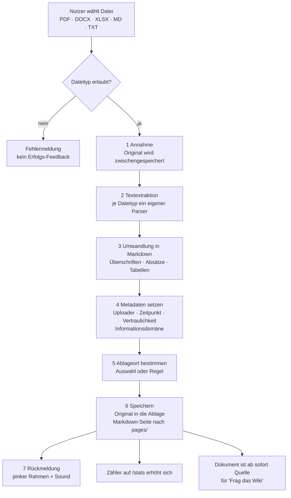

# Funktionsweise: Wie Dateien verarbeitet werden

Teil der Funktionsbeschreibung des Systems (Arbeitspaket 3). Dieses Kapitel beschreibt genau
einen Weg: **wie eine hochgeladene Datei zu durchsuchbarem Wissen wird.** Der Frageweg und die
vier Experten-Agenten folgen in eigenen Kapiteln.

Stand: 2026-09-05 · Basis: `PLAN.md`, `Arbeitspakete.md`, Code unter `llm-wiki/`

---

## 1. In einem Satz

Eine hochgeladene Datei wird in Text umgewandelt, mit Metadaten versehen, an einem
nachvollziehbaren Ablageort gespeichert und als Markdown-Seite in die Wissensbasis gelegt —
ab dann kann sie bei jeder Frage als Quelle auftauchen.

---

## 2. Zwei Wege ins Wissen

Es gibt zwei Arten, wie Dokumente ins System kommen. Das ist der häufigste Punkt der
Verwirrung, deshalb steht er ganz vorn.

| | **A: Demo-Korpus** | **B: Upload** |
|---|---|---|
| Was | 216 vorbereitete Dokumente der fiktiven Lahnberg Thermotechnik GmbH | Dateien, die ein Nutzer im Betrieb hochlädt |
| Wo | `corpus/`, 9 Ablageorte, Zeitraum 2011–2025 | `llm-wiki/pages/` + Ablage der Originaldatei |
| Format | Markdown mit YAML-Frontmatter (13 Metadatenfelder) | PDF, DOCX, XLSX, MD, TXT → wird zu Markdown |
| Status | **liegt im Repo** | **Zielbild, Arbeitspaket 2** |
| Vom Wiki durchsucht | **nein** (noch nicht angebunden) | ja |

Der Korpus ist damit heute die realistische Wissenslandschaft *auf der Platte*, aber noch
nicht die Wissensbasis *der laufenden Anwendung*. Der Upload-Weg produziert die Struktur, die
den Korpus später einlesbar macht — beide treffen sich im selben Metadaten-Schema (Abschnitt 5).

---

## 3. Was heute wirklich passiert (IST)

Im laufenden LLM-Wiki gibt es **noch keinen Datei-Upload**. Inhalte entstehen ausschließlich
über zwei Formulare:

- `GET/POST /new` — neue Seite anlegen (`llm-wiki/app/main.py:115`)
- `GET/POST /wiki/{slug}/edit` — bestehende Seite ändern (`llm-wiki/app/main.py:91`)

Ein Speichervorgang läuft so (`llm-wiki/app/wiki.py`):

1. **Slug bilden** — `slugify(titel)`: kleinschreiben, Leerzeichen zu `-`, alles außer
   `a–z 0–9 -` wird **entfernt**. Umlaute fallen dabei weg; aus „heute ist ein schöner Tag"
   wird die Datei `heute-ist-ein-schner-tag.md`. Nachzusehen in `llm-wiki/pages/`.
2. **Datei schreiben** — `llm-wiki/pages/<slug>.md`, Inhalt `# <Titel>` + Leerzeile + Text.
   Der Titel lebt in der ersten Zeile, nicht in Metadaten.
3. **Fertig.** Kein Frontmatter, keine Datenbank, kein Index, kein Uploader, kein Zeitstempel,
   kein Ablageort. Das Dateisystem *ist* die Wissensbasis.

Beim Umbenennen wird die alte Datei gelöscht und unter neuem Slug neu geschrieben
(`llm-wiki/app/main.py:100`) — ein gleicher Titel überschreibt also stillschweigend eine
bestehende Seite. Eine Dublettenprüfung gibt es nicht.

Gelesen wird bei **jeder** Anfrage frisch von der Platte (`list_pages()` durchläuft
`pages/*.md`). Deshalb ist eine neue Datei sofort auffindbar, ohne Neustart und ohne
Reindexierung — der Preis ist, dass die Suche linear über alle Dokumente läuft.

---

## 4. Der Upload-Weg (ZIEL)

So soll eine Datei künftig verarbeitet werden. Die Schritte 1–6 sind der Kern von
Arbeitspaket 2, flankiert von 7 (Ablage), 1 (Metadaten/Rechte), 5 (Feedback) und 6 (Zähler).



**Schritt für Schritt:**

| # | Schritt | Was passiert | Paket |
|---|---------|--------------|-------|
| 1 | Annahme | Datei entgegennehmen, Typ und Größe prüfen. Unerlaubter Typ → klare Fehlermeldung, **kein** Erfolgs-Feedback. | 2 |
| 2 | Textextraktion | Pro Dateityp ein Parser (siehe Abschnitt 6). Ergebnis ist reiner Text plus grobe Struktur. | 2 |
| 3 | Markdown | Text wird zur Wiki-Seite: `# Titel`, Absätze, Tabellen. Absätze sind wichtig — die Suche arbeitet absatzweise. | 2 |
| 4 | Metadaten | Frontmatter nach dem Schema aus Abschnitt 5. Mindestens Uploader und Zeitpunkt, dazu Vertraulichkeit und Informationsdomäne. | 1 |
| 5 | Ablageort | Zu welchem Bereich gehört das Dokument (Projektlaufwerk, Finance, HR …)? Auswahl beim Upload oder Regel. | 7 |
| 6 | Speichern | Originaldatei bleibt erhalten und auffindbar, die Markdown-Seite landet in `llm-wiki/pages/`. | 2 + 7 |
| 7 | Rückmeldung | Sichtbar (pinker Rahmen) und hörbar (lokaler Sound), verschwindet nach wenigen Sekunden. Zähler auf `/stats` steigt ohne Neustart. | 5 + 6 |

Ab Schritt 6 ist das Dokument Teil der Wissensbasis: Die nächste Frage unter „Frag das Wiki"
durchsucht es automatisch mit, weil bei jeder Anfrage frisch von der Platte gelesen wird.

---

## 5. Das Metadaten-Schema

Der Demo-Korpus gibt das Schema bereits vor — **alle 216 Dokumente** tragen dieselben
13 Felder im YAML-Frontmatter. Der Upload sollte dieselben Felder füllen, sonst zerfällt die
Wissensbasis in zwei Welten.

```yaml
---
doc_id: LTT-20200929-IT-A20          # eindeutige Dokumentnummer
titel: Softwareportfolio der LTT-Gruppe 2020
dokumenttyp: Softwareportfolio       # Policy, SOP, Meeting Minutes, Management Summary …
datum: 2020-09-29                    # fachliches Dokumentdatum, nicht der Uploadzeitpunkt
verfasser: Karin Löbner
rolle: Leiterin IT
organisationseinheit: IT
empfaenger: []
projekt: "-"
geschaeftsbereich: "-"
vertraulichkeit: intern              # intern | C-Level | Betriebsrat-intern
informationsdomaene: [unternehmensweit]
ablageort: it_doku                   # einer von 9 Ablageorten
---
```

Drei Felder tragen die Logik des Gesamtsystems:

- **`vertraulichkeit`** — im Korpus 180× `intern`, 23× `C-Level`, 13× `Betriebsrat-intern`.
  Daran hängt Arbeitspaket 1: Treffer, die der Fragende nicht sehen darf, dürfen dem LLM gar
  nicht erst vorgelegt werden. Das ist die technische Umsetzung der Informationsgrenzen aus
  `PLAN.md` §4.
- **`datum`** — der Korpus spannt 2011 bis 2025 und enthält bewusst veraltete und
  widersprüchliche Aussagen (`PLAN.md` §3). Ohne Datum kann kein Agent Aktualität beurteilen.
- **`ablageort`** — bestimmt die Ordnerstruktur (Paket 7), leitet Rechte ab (Paket 1) und ist
  die Gruppierung in der Statistik (Paket 6).

Die 9 Ablageorte im Korpus mit ihrer Dokumentzahl:

| Ablageort | Dok. | Ablageort | Dok. |
|---|---:|---|---:|
| `sharepoint_gf` | 47 | `qm_lenkung` | 24 |
| `projektlaufwerk` | 36 | `einkauf_scm` | 21 |
| `it_doku` | 29 | `sharepoint_hr` | 18 |
| `br_ablage` | 15 | `sharepoint_finance` | 14 |
| `mailarchiv` | 12 | | |

---

## 6. Was pro Dateityp zu tun ist

| Typ | Extraktion | Fallstricke |
|---|---|---|
| **MD / TXT** | direkt übernehmen | Vorhandenes Frontmatter erkennen und nicht als Fließtext behandeln |
| **DOCX** | Absätze und Tabellen auslesen | Deckblätter sowie Kopf- und Fußzeilen erzeugen Rauschen; die Project Charter in `test project data/` sind der Testfall |
| **PDF** | Textlayer auslesen | Gescannte PDFs haben keinen Textlayer → OCR wäre nötig, für den Hackathon außerhalb des Umfangs. Solche Dateien klar abweisen statt leer speichern |
| **XLSX** | Blätter zu Markdown-Tabellen | Business Cases sind Zahlenwerke — Formelergebnisse zählen, nicht Formeln; jedes Blatt einzeln benennen |

Testmaterial liegt bereit: `test project data/` enthält vier Project Charter (DOCX) und vier
Business Cases (XLSX) zu genau den Projekten, die auch als `project_proposals/*.md` vorliegen.
Das Abnahmekriterium von Paket 2 lautet, dass ein Project Charter daraus hochgeladen wird und
anschließend als Quelle unter „Frag das Wiki" erscheint.

---

## 7. Wie die Datei danach gefunden wird

Kurz, weil es der Übergang zum nächsten Kapitel ist. Die Suche ist **keine Vektorsuche**,
sondern ein Wortabgleich (`llm-wiki/app/wiki.py:77`):

1. Frage und Absatz werden in Wortmengen zerlegt.
2. Pro Absatz zählt die Überschneidung mit den Fragewörtern, geteilt durch die Zahl der
   Fragewörter. Titelwörter zählen zum Absatz dazu.
3. Die besten 5 Absätze gehen als Kontext an Claude, das ausschließlich daraus antwortet
   (`llm-wiki/app/llm.py`).

Praktische Folge für die Dateiverarbeitung: **Absatzgrenzen und Überschriften sind die
eigentliche Qualität der Extraktion.** Ein DOCX, das als eine einzige Textwand ankommt, liefert
einen Treffer, der zu groß ist; sauber getrennte Absätze liefern präzise Belegstellen. Synonyme
helfen nicht — was nicht wörtlich in der Frage vorkommt, wird nicht gefunden.

---

## 8. Abgleich mit PLAN.md — umgesetzt vs. Zielbild

| Aus `PLAN.md` | Stand |
|---|---|
| §3 Wissensbasis als RAG-System | **teilweise** — Retrieval existiert, aber als Wortabgleich statt Embeddings |
| §3 Realistischer Korpus mit Widersprüchen und Zeitbezug | **vorhanden** als `corpus/` (216 Dok., 2011–2025), **noch nicht** an die Anwendung angebunden |
| §3 Rückführung neuen Wissens (*Retrieve → … → Store → Reuse*) | **offen** — der Upload-Weg ist die Vorstufe dazu |
| §4 Zugriffsrechte, Informationsklassifikation, Herkunft | **im Schema angelegt** (`vertraulichkeit`, `verfasser`, `informationsdomaene`), **nicht durchgesetzt** — Paket 1 |
| §5 Orchestrator-Agent | **offen** |
| §6 Vier Experten-Agenten | **eine Rolle** liegt als Dokument vor: `bewertungen/cfo-bewertung-projektportfolio.md`; keine Agenten im Code |
| §8 Output-Schema | **uneinheitlich, siehe unten** |
| Externe Recherche / Web-Skill | **offen** |

**Ein offener Widerspruch, der geklärt gehört:** `PLAN.md` §8 verlangt pro Agent *drei* Scores
(`value_score`, `risk_score`, `strategy_score`) auf einer Skala 0–100 im Format JSONL.
`Bewertungslogik_Experten-Agent_MVP.md` verlangt *einen* Score auf einer Skala 0–10 und verbietet
ausdrücklich jede Bewertung bei fehlenden Informationen. Die bereits erstellte CFO-Bewertung folgt
der zweiten Variante. Solange das nicht entschieden ist, kann der Orchestrator die vier
Stellungnahmen nicht zusammenführen — das trifft Paket 4 und die späteren Agenten-Pakete.

**Zweiter Punkt:** Der Korpus beschreibt die Lahnberg Thermotechnik GmbH, die Projektvorschläge
unter `project_proposals/` betreffen ein anderes fiktives Unternehmen („Company 1" / „Company 2").
Die CFO-Bewertung hat den Korpus deshalb bewusst ausgeklammert. Für die Demo heißt das: Vorschlag
und Wissensbasis passen inhaltlich (noch) nicht zusammen.

---

## 9. Wer liefert was

| Frage | Paket | Verantwortlich |
|---|---|---|
| Welche Metadaten, wer darf was sehen? | 1 | Anselm |
| Upload-Formular und Textextraktion | 2 | Ekkehardt |
| Dieses Dokument | 3 | Florian |
| Dublettenerkennung gegen bestehende Projekte | 4 | Marc |
| Rückmeldung nach erfolgreichem Upload | 5 | Oxana |
| Zähler über die Wissensbasis | 6 | Antje |
| Ablageorte und Ordnerstruktur | 7 | Frank |

Reihenfolge: Paket 1 legt das Schema fest, 2 und 7 bauen den eigentlichen Weg, 5 und 6 hängen
sich an das Erfolgsereignis. Bis der Upload steht, arbeiten 5 und 6 gegen einen Testbutton.
